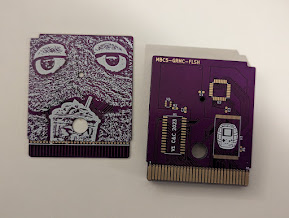
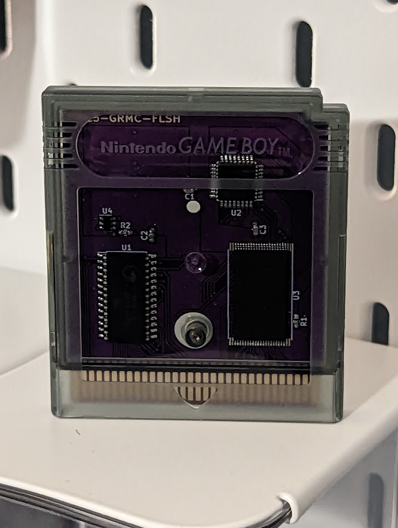
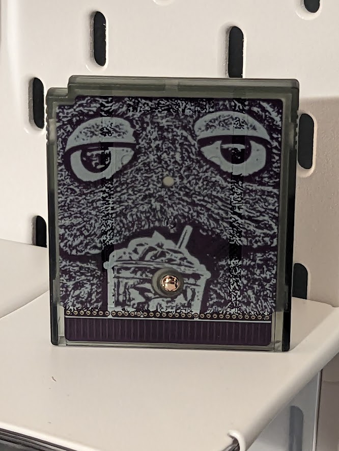

# MBC5-Grimace-Flash
Game Boy MBC5 Fram Flash Cart

This uses djedditt's footprints and outlines: https://github.com/djedditt/kicad-gamepaks

## BOM
| Ref | Part |
| ------------- | ------------- |
| Resistors  | 10k 0603  |
| Capacitors  | 0.1uF 0603  |
| FRAM | FM18W08 |
| Flash | AM29F016B (2MB) or AM29F032/MBM29F033 (4MB) |
| U4 | 74LVC1G332 |
| MBC5 | Harvested from OEM Cart |

## Disclaimer
I am not responsible for any damage you do to your person or property. I do not guarantee design compatibility. You may encounter issues with certain games! Attempt this project at your own risk.

If you are using this board to make games other than for personal use, you must have permission from the originator to use and distribute any ROM images or other related material. You are responsible for making sure you adhere to any license requirements. DO NOT use my circuit boards to distribute or resell copyrighted Nintendo software. DO NOT use my circuit boards for profiting from stolen work - this especially includes homebrew content, ROM hacks, and using fan-made labels without permission from the originator.

## License
CC-BY-SA 4.0 - https://creativecommons.org/licenses/by-sa/4.0/

You are free to:

Share — copy and redistribute the material in any medium or format for any purpose, even commercially.

Adapt — remix, transform, and build upon the material for any purpose, even commercially.

The licensor cannot revoke these freedoms as long as you follow the license terms.

Under the following terms:

Attribution - You must give appropriate credit , provide a link to the license, and indicate if changes were made . You may do so in any reasonable manner, but not in any way that suggests the licensor endorses you or your use.

ShareAlike - If you remix, transform, or build upon the material, you must distribute your contributions under the same license as the original.

No additional restrictions - You may not apply legal terms or technological measures that legally restrict others from doing anything the license permits.

